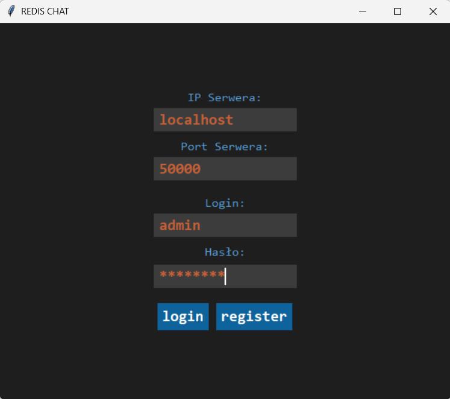
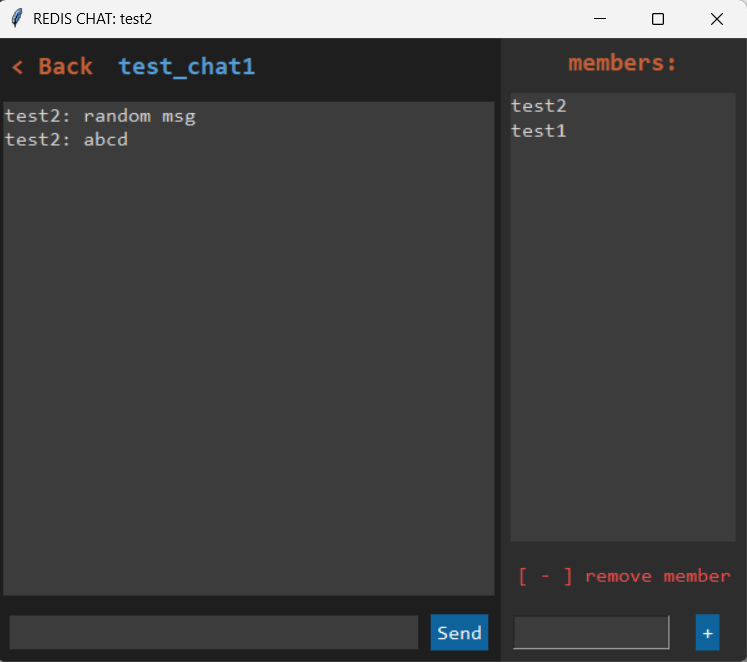
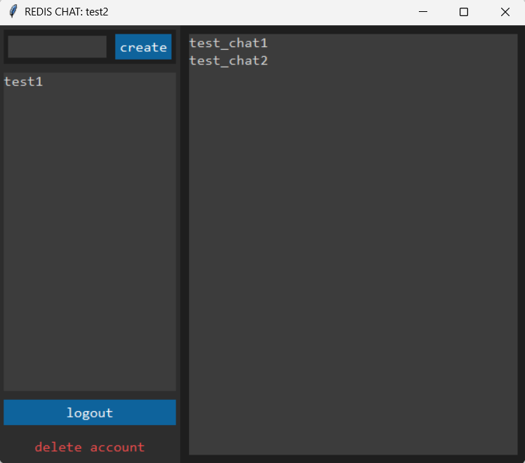

# Real-Time TCP Chat Application



A multithreaded, real-time chat application built with Python sockets, Tkinter GUI, and a Redis backend, fully containerized for easy deployment.

## About the Project
This is a personal project I developed to learn about Redis and the use of Docker with server-side applications. I developed it to a fully functional state, though it is not yet a good communicator. For example, there is currently no SSL/TLS encryption for data in transit (passwords are sent over the network without encryption), although they are securely hashed before being stored in the database.

## Key Features
* **Custom TCP Protocol:** Communication is handled via TCP sockets utilizing a 4-byte message length header to prevent stream desynchronization.
* **Thread-Safe Architecture:** The server handles multiple client connections simultaneously using Python's `threading` module and thread locks.
* **Validation & Security:** Strict server-side payload validation is implemented using **Pydantic**. User passwords are encrypted using **Bcrypt** before being stored.
* **Group Management:** Users can dynamically create new chat rooms, add members by username, and remove participants.
* **Persistent Chat History:** Leveraging **Redis Streams**, chat logs are safely stored and chronologically ordered, allowing users to retrieve past messages seamlessly.
* **Containerized Environment:** The Redis database and server environment are handled using **Docker Compose** with persistent AOF volumes.

## Application Interface

|  |  |
|:---:|:---:|
| *Chat window* | *Main menu* |

## Database Schema (Redis)
Redis is the perfect match for this type of project. It is incredibly fast, and its **Streams** data structure is natively optimized for appending and reading chat logs based on timestamps or IDs.

The database structure in this project relies on Hashes, Sets, and Streams:

**Users:**
* `user:id_counter` (String) – Auto-incrementing ID counter.
* `users:by_name` (Hash) – Key: username, Value: ID.
* `user:{id}:credentials` (Hash) – Stores username and Bcrypt-hashed password.
* `user:{id}:chats` (Set) – Collection of chat IDs the user belongs to.
* `users:all` (Set) – Set of all registered users' IDs.

**Chats:**
* `chat:id_counter` (String) – Auto-incrementing ID counter.
* `chats:by_name` (Hash) – Key: chat name, Value: ID.
* `chats:by_id` (Hash) – Key: ID, Value: chat name.
* `chat:{id}:members` (Set) – IDs of participants in a specific chat.
* `chat:{id}:messages` (Stream) – Chronological chat log.

> **Note on Deletion:** Users can delete their accounts permanently. When this happens, their credentials and username are freed up, but their historical messages remain intact in the chat streams to preserve conversation context. Empty chats (with 0 members) are automatically garbage-collected.

## How to Run the Project Locally
**Prerequisites:**
* [Docker Desktop](https://www.docker.com/products/docker-desktop/) installed and running.
* Python 3.x installed locally for the client GUI.

**Instructions:**
1. Clone the repository to your local machine.
2. Open your terminal in the project's root directory.
3. Start the backend server and database using Docker Compose:
    ```bash
        docker compose up --build
    ```
4. Start the client gui
    ```bash
        python client/cli_gui.py
    ```